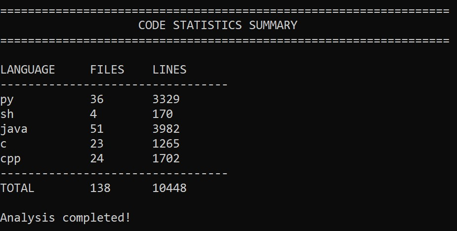

# 📊 GitHub Code Line Counter


A simple Bash utility to **count the number of source code files and lines** in all **public, non-archived GitHub repositories** of a given user. It supports multiple file types and provides a breakdown by language.

---

## 🧰 Features

- Clones all **non-archived** public repos of a GitHub user
- Counts the number of **files and lines** for each supported programming language
- Prints a **summary table** showing totals
- Automatically **cleans up** cloned repos after analysis
- Supports many languages: Python, Shell, Java, C/C++, JavaScript, SQL, Assembly, etc.

---

## 🧪 Supported File Types

```bash
py sh ps1 java c cpp dll js ts rb go rs php cs swift kt dart pl r sql asm clj ex sqlite db
```

> You can **add more** by editing the `file_types` array at the top of the script.

---

## 🚀 Usage

```bash
./git_count_line.sh <github_username>
```

## Example

```bash
./git_count_line.sh octocat
```

This will:

1. Fetch all public non-archived repositories of the user `octocat`
2. Clone each one
3. Scan the contents for known file types
4. Count the number of files and lines per file type
5. Display a summary
6. Clean up all cloned repositories

---

## 📄 Output Example



---

## License

This project is licensed under the [MIT License](LICENSE).